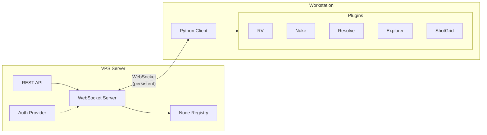

# OpenClaw Node

Remote execution framework for VFX/post-production pipeline automation. Execute commands on workstations from a central server via WebSocket connections.

## Architecture



## Features

- **WebSocket Server**: Persistent connections with auto-reconnection
- **Plugin System**: Extensible actions for different applications
- **REST API**: Query nodes, execute commands, check health
- **Auth Providers**: Pre-shared tokens (OAuth-ready architecture)
- **Cross-Platform**: Windows, macOS, Linux support
- **Service Mode**: Run as systemd/launchd/Windows service

## Quick Start

### Installation

```bash
# Clone the repo
git clone https://github.com/throb/openclaw-node.git
cd openclaw-node

# Create virtual environment
python3 -m venv .venv
source .venv/bin/activate  # or .venv\Scripts\activate on Windows

# Install dependencies
pip install -e ".[dev]"
```

### Run the Server

```bash
# Set auth token
export OPENCLAW_NODE_TOKEN="your-secret-token"

# Start server
cd openclaw-node
python -m uvicorn server.main:app --host 0.0.0.0 --port 8765
```

### Run a Client

```bash
# First run creates config interactively
python -m client.main

# Or with explicit config
python -m client.main --config /path/to/config.yaml
```

### Test the Connection

```bash
# Check server health
curl http://localhost:8765/api/health

# List connected nodes
curl http://localhost:8765/api/nodes

# Execute a command
curl -X POST http://localhost:8765/api/nodes/my-node/exec \
  -H "Content-Type: application/json" \
  -d '{"action": "explorer.ping", "params": {}}'
```

## Configuration

### Server

Environment variables:
- `OPENCLAW_NODE_TOKEN`: Single auth token
- `OPENCLAW_TOKENS`: Comma-separated list of tokens
- `OPENCLAW_TOKENS_FILE`: Path to YAML file with tokens

### Client

Config file (`~/.config/openclaw/node_config.yaml` on Linux):

```yaml
node_id: my-workstation
server_url: wss://your-server.com:8765/ws
auth_token: your-secret-token

plugins:
  - explorer
  - rv
  - nuke

allowed_paths:
  - /path/to/projects
```

## Plugins

| Plugin | Actions | Platforms |
|--------|---------|-----------|
| explorer | open_folder, reveal_file, ping | All |
| rv | open_session, open_sources, ping | All |
| resolve | add_to_media_pool, create_timeline, get_current_project, ping | Win, Mac |
| nuke | render_write, open_script, get_info, ping | All |
| shotgrid | publish_version, update_task_status, get_shot_info, ping | All |

## API Endpoints

| Method | Endpoint | Description |
|--------|----------|-------------|
| GET | /api/health | Server health check |
| GET | /api/nodes | List connected nodes |
| GET | /api/nodes/{id} | Get node details |
| POST | /api/nodes/{id}/exec | Execute command on node |
| GET | /api/plugins | List available plugins |

## Service Installation

```bash
# Install as system service
python -m client.main install

# Check status
python -m client.main status

# Start/stop
python -m client.main start
python -m client.main stop
```

## Development

```bash
# Run tests
pytest tests/ -v

# Type checking
mypy server/ client/ plugins/

# Linting
ruff check .
```

## License

MIT
